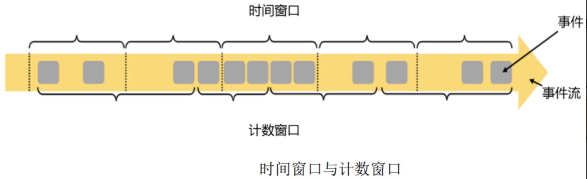
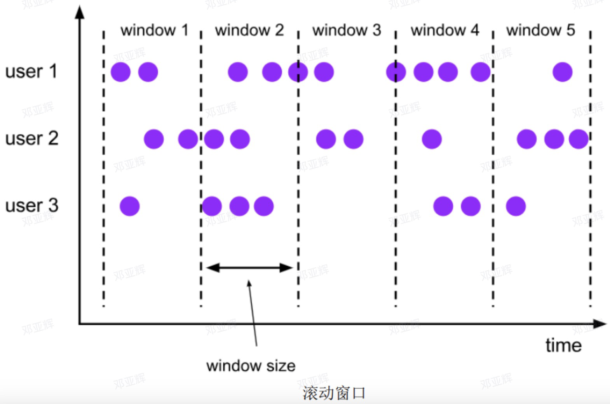
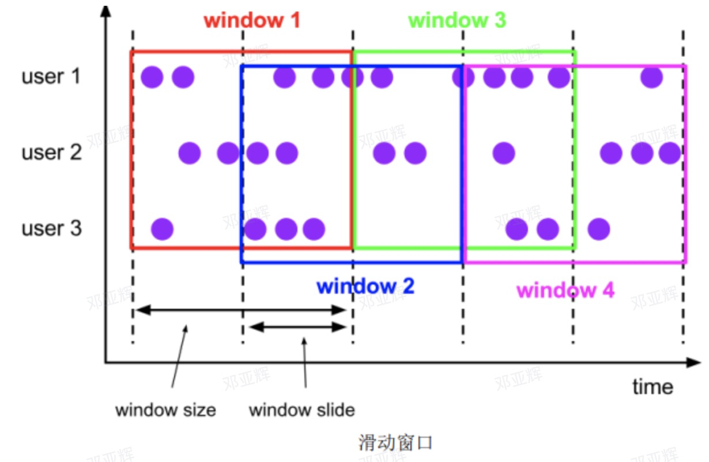
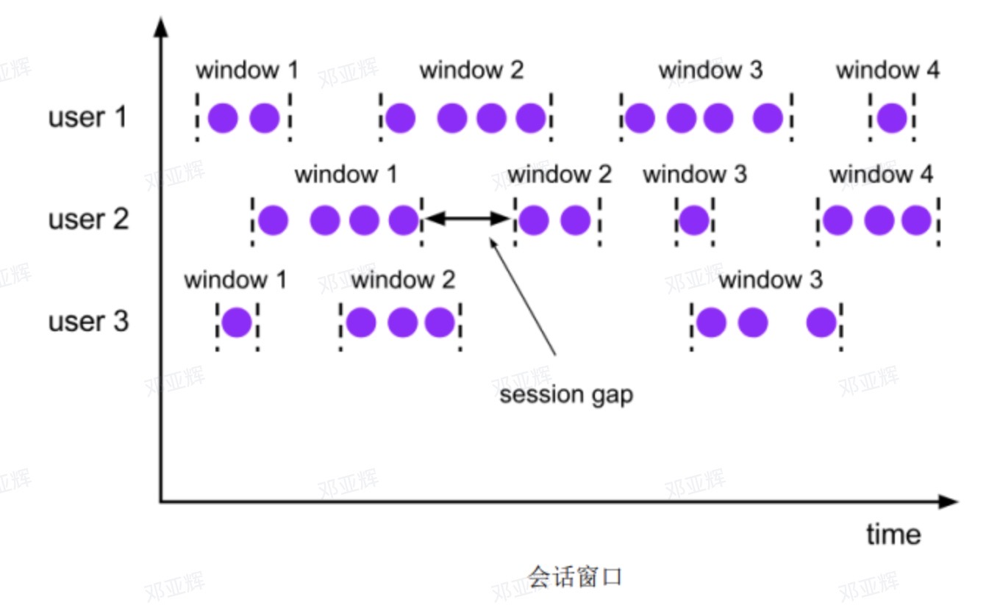
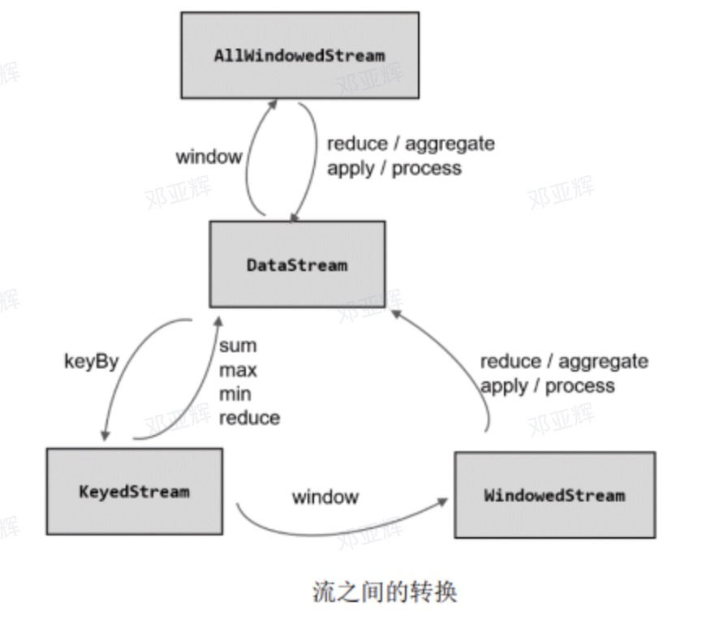
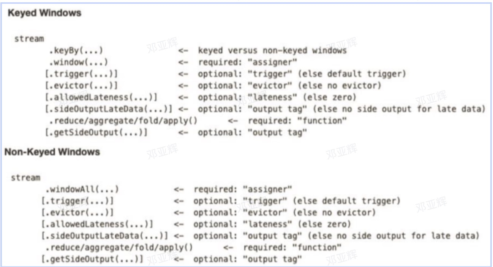

summary:
    将无限数据切割成有限的”数据块“进行处理，处理无界流的核心。
    
    把窗口看成一个个桶，数据都会发到对应的桶中，当达到窗口结束时间时，就对每个桶中收集的数据进行计算处理。
    动态创建：当有落在这个窗口区间范围的数据达到时，才创建对应的窗口
    窗口关闭：到达窗口结束时间时，窗口就触发计算并关闭

窗口分类：
    按照驱动类型分类：时间窗口、计数窗口
    
    （1）时间窗口
    时间窗口以时间点到来定义窗口的开始和结束，所以截取的就是某一时段的数据。到达结束时间时，窗口不在收集数据，触发计算输出结果，并将窗口关闭销毁。
    窗口大小= 结束时间- 开始时间
    Flink有一个专门的TimeWindow类表示时间窗口，这两个类只有两个私有属性，表示窗口的开始和结束的时间戳，单位为毫秒，其中maxTimestamp()方法，用来获取窗口中能够包含数据的最大时间戳。
计数窗口：
    只需指定窗口大小，把数据分配到对应的窗口中，Flink内部对应的类来表示计数窗口，底层通过全局窗口实现。

按照窗口分配数据的规则分类：
   滚动窗口
   
   有固定的大小，对数据进行均匀切片，每个数据都会分配一个窗口，智慧属于一个窗口。
   也可以基于时间定义，也可以基于数据个数定义；需要的参数只有窗口大小，定义一个长度为1h的滚动时间窗口，那么每个小时就会进行一次统计；或者定义长度为10的滚动技术窗口，就会每10个数进行一次统计

   滑动窗口
   
   滑动窗口的大小固定，但窗口之间不是首位相接，二有部分重合。滑动窗口可以基于时间定义、数据个数。
   定义滑动窗口的参数与两个：窗口大小，滑动步长。滑动步长是固定的，且代表了两个窗口开始/结束的时间间隔。数据分配到多个窗口的个数=窗口大小/滑动步长。

   会话窗口
   
   size:两个会话窗口之间的最小距离。可以设置静态固定的size，也可以通过一个自定义的提取器动态提取最小间隔gap的值。

   Flink的底层，对会话窗口的特殊处理：来一个新的数据，都会创建一个新的会话窗口，然后判断已有窗口之间的距离，如果小于给定的size，就对它们进行合并操作。在Window算子中，对会话窗口有单独的处理逻辑。会话窗口的长度不固定、起始和结束时间不确定，各个分区窗口之间没有任何关联。会话窗口之间一定是不会重叠的，且会留至少为size的间隔。

窗口API概览
    按键分区窗口（keyed）
    在定义窗口操作之前，首选需要确定，到达时基于按键分区（keyed）的数据流keyedStream来开窗，还是直接在没有按键分区的DataStream上开窗。也就是在调用窗口算子之前是否有keyBy操作。
    经过按键分区keyBy操作之后，数据流会按照key备份为多条逻辑流（logical streams），也就是KeyedStream。基于KeyedStream进行窗口操作时，窗口计算会在多个并行子任务上同时进行。相同key的数据被发送到同一个并行子任务，而窗口操作会基于每个key单独的处理。可以认为每个key上都定义了一组窗口，鸽子独立地进行统计计算。
    非按键分区（Non-keyed）
    如果没有进行keyBy，name原始的DataStream就不会分成多条逻辑流。这时窗口只能在一个任务（task)上执行，相当于并行度变成1.
    窗口分配器（Window Assigners）和窗口函数（Window Function）
    stream.keyBy(<key selector>).window(<window assigner>).aggregate(<window function>)

窗口分配器
1.时间窗口
（1）滚动处理时间窗口
stream.keyBy(...).window(TumblingProcessingTimeWindows.of(Time.seconds(5))).aggregate(...)
创建一个长度为5s的滚动窗口

of()方法可以重载，可以设置定时开启

（2）滑动处理时间窗口
stream.keyBy(...).window(SlidingProcessingTimeWindows.of(Time.seconds(10)，Time.seconds(5))).aggregate(...)
两个Time类型的参数：size和slide。后者表示滑动窗口的滑动步长。

（3）处理时间会话窗口
stream.keyBy(...).window(ProcessingTimeSessionWindows.withGap(Time.seconds(5))).aggregate(...).withGap().window(ProcessingTimeSessionWindows.withDynamicGap(new SessionWindowTimeGapExtractor<Tuple2<String,Long>>(){
    @Override
    public long extract(Tuple2<String,Long> elemnt){
        return elemnt.f0.length() * 1000;
    }
}))

动态提取时间间隔，这里提取数据元素的第一个字段，用它的长度以1000作为会话超时的间隔

（4）滚动事件事件窗口
stream.keyBy(...).window(TumblingEventTimeWindows.of(Time.seconds(5))).aggregate(...)

（5）滑动事件时间窗口
stream.keyBy(...).window(TSlidingEventTimeWindows.of(Time.seconds(10),Time.seconds(5))).aggregate(...)

（6）事件时间会话窗口
stream.keyBy(...).window(EventTimeSessionWindows.withGap(Time.seconds(10))).aggregate(...)

2.计数窗口
直接调用countWindow()方法，根据分配规则的不同，又可以分为滚动计数、滑动计数窗口。
（1）滚动计数窗口
stream.keyBy().countWindow(10)
(2)滑动计数窗口
stream.keyBy().countWindow(10,3)
长度为10，步长为3

3.全局窗口
stream.keyBy().window(GlobalWindows.create())

使用全局窗口，必须自定义触发器才能实现窗口计算，否则起不到任何作用。

窗口函数（Window Functions）
定义窗口分配，明确数据属于哪个窗口；定义窗口函数，如何进行计算的操作，这就是所谓的窗口函数。

根据处理的方式进行分类：增量聚合函数、全窗口函数

增量函数：
窗口将数据收集起来，最基本的处理操作当然就是进行聚合。窗口对无限流的切分，得到一个有界数据集。
增量聚合函数：ReduceFunction、AggreagateFunction
（1）归约函数（ReduceFunction）
数据两两归约，实现增量式的聚合。
（2）聚合函数（AggreagateFunction）
有一个限制：输入数据类型、聚合状态类型、数据结果的类型一样。
Flink的Window API中的Aggregate提供这样的操作。

全窗口函数
（1）窗口函数
（2）处理窗口函数

增量聚合和全窗口结合

调用API总结

