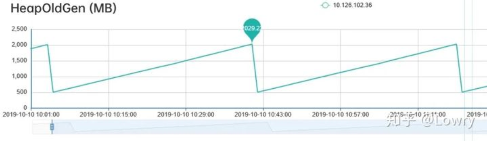
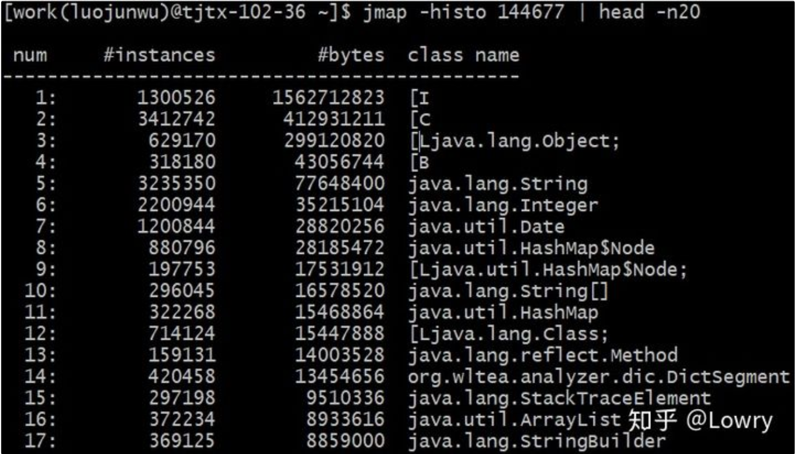
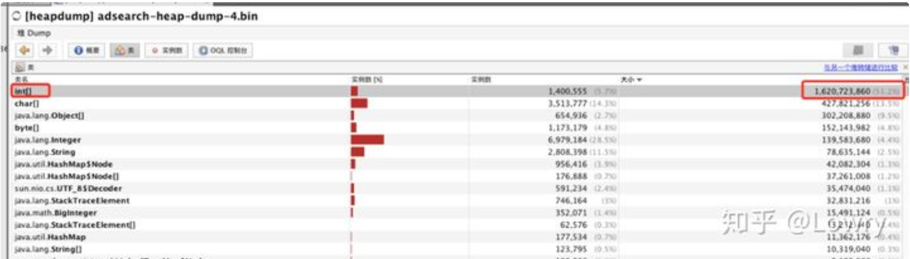
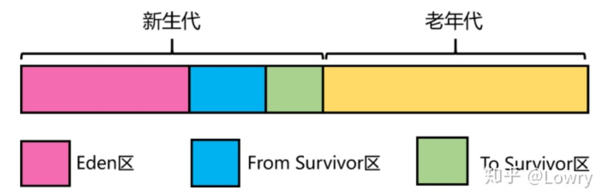
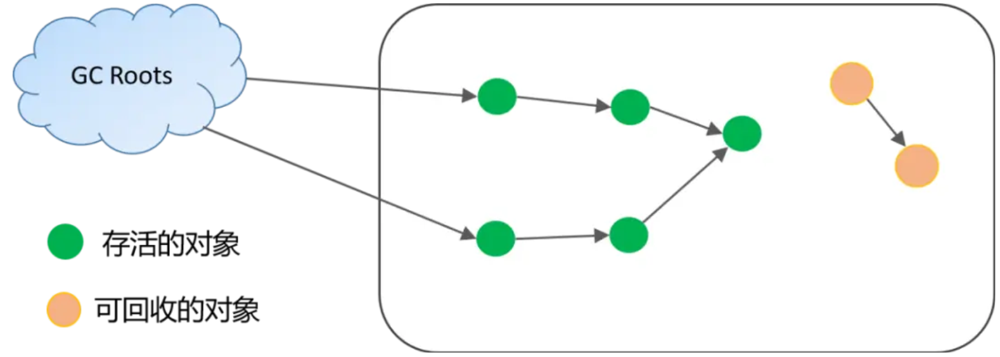
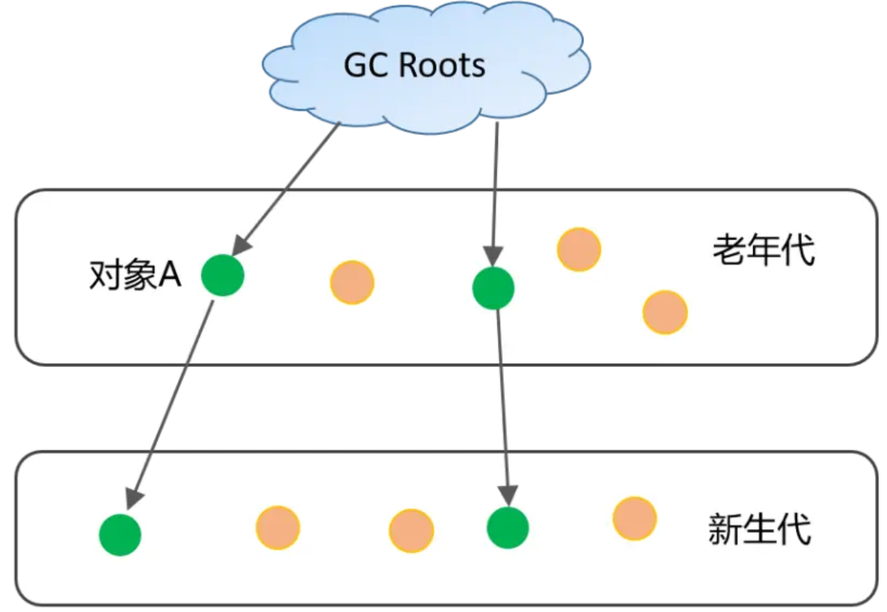

线上问题排查

服务线上问题可能的问题：
例如 CPU 使用率峰值突然飚高、内存溢出 (泄露)、磁盘满了、网络流量异常、FullGC 等等问题。

系统异常：
常见的系统异常现象包括: CPU 占用率过高、CPU 上下文切换频率次数较高、磁盘满了、磁盘 I/O 过于频繁、网络流量异常 (连接数过多)、系统可用内存长期处于较低值 (导致 oom killer) 等等。

业务服务异常：
常见的业务服务异常现象包括: PV 量过高、服务调用耗时异常、线程死锁、多线程并发问题、频繁进行 Full GC、异常安全攻击扫描等。

1.cpu不高 load高
jstack -l pid | grep BLOCKED 查看阻塞态线程堆栈

2.内存的问题
OutOfMemoryError：java heap space
OutOfMemoryError: GC overhead limit exceeded  默认情况下, 如果GC花费的时间超过 98%, 并且GC回收的内存少于 2%, JVM就会抛出这个错误
OutOfMemoryError：permgem space 元数据大小超过jvm参数配置
OutOfMemoryError：Metaspace 元数据大小超过jvm参数配置
java.lang.StackOverflowError 一般线程栈溢出是由于递归太深或方法调用层级过多导致的

排查流程
1.查看当前jvm内存的参数配置：jmap -heap pid
2.查看gc的情况：jstat -gcutil pid
3.内存dump：jmap  -dump:format=b,file=/tmp/dump.dat pid 这个命令在线上慎用，会导致系统变慢
4.内存分析工具

3.网络
1、http链接无法建立，有大量close_wait的tcp连接
2、tcp重传率高

关于网络问题，我在上家公司刚好遇到过，大量的等待tcp连接导致系统濒临宕机，后来发现是网络带宽500M变成了200M的问题。

4.数据库问题
1、大数据量查询没有走索引，导致慢sql的出现
2、sql中存在各种导致索引失效的操作
通过运维工具（比如rds）找到sql执行时间最长的top10，通过explain查看sql执行是否走了索引，然后加索引优化。

网络流量飙高
1、sql没有设置limit导致全部数据返回
2、sql的请求数量快速增加
解决方式：
1、在搜索代码中务必加上limit
2、运维工具查看异常时间段的sql执行情况

系统资源正常，sql一直阻塞
1、通过数据库监控工具查找执行时间长的sql
2、将执行时间长的sql直接kill掉

定位原因：
1、代码是否有更新
2、数据库是否有变更
3、网络是否做了切换
4、其他应用是否会影响你的应用
5、是否有流量突然变大的情况

查看堆内存各区域的使用率以及GC情况
jstat -gcutil -h20 pid 1000

查看堆内存的存活对象，并按空间排序
jmap -histo pid | head -n20

Dump堆内存文件
jmap -dump:format=b,file=heap pid

FGC问题的排查
系统出现了多次和GC相关的线上问题，有Full GC过于频繁的，有Young GC耗时过长的，这些问题带来的影响是：GC过程中的程序卡顿，进一步导致服务超时从而影响业务稳定。
1.FGC频繁的案例
 　　1.问题调查和原因分析
* 第1步：通过以下命令查看JVM的启动参数：ps aux | grep "applicationName=adsearch"
-Xms4g -Xmx4g -Xmn2g -Xss1024K
-XX:ParallelGCThreads=5
-XX:+UseConcMarkSweepGC
-XX:+UseParNewGC
-XX:+UseCMSCompactAtFullCollection
-XX:CMSInitiatingOccupancyFraction=80

可以看到堆内存为 4G，新生代为 2G，老年代也为 2G，新生代采用 ParNew 收集器，老年代采用并发标记清除的 CMS 收集器，当老年代的内存占用率达到 80% 时会进行FGC。
　　进一步通过 jmap -heap 7276 | head -n20 可以得知新生代的 Eden 区为1.6G，S0 和S1 区均为0.2G。
　　第2步：通过观察老年代的使用情况，可以看到：每次FGC后，内存都能回到500M左右，因此我们排除了内存泄漏的情况。
 　 
    第3步：通过jmap命令查看堆内存中的对象，通过命令 jmap -histo 144677 | head -n20
    
    可以看到排名第一的是：int[]，而且所占内存大小远远超过其他存活对象。至此，我们将怀疑目标锁定在了 int[]。
    第4步：进一步dump堆内存文件进行分析。锁定 int[] 后，我们打算 dump 堆内存文件，通过可视化工具进一步跟踪对象的来源。考虑堆转储过程中会暂停程序，因此我们先从服务管理平台摘掉了此节点，然后通过以下命令 dump 堆内存：
jmap -dump:format=b,file=heap 7276 通过 JVisualVM 工具导入 dump 出来的堆内存文件，同样可以看到各个对象所占空间，其中 int[] 占到了 50% 以上的内存，进一步往下便可以找到 int[] 所属的业务对象。

    第5步：通过代码分析，每分钟会生成约 40M大小的 int数组，用于统计TP99和TP90，数组的生命周期是一分钟。而根据第2步观察老年代的内存变化时，发现老年代的内存基本上也是每分钟增加40多M，因此推断：这40M的int数组应该是从新生代晋升到老年代。
    　
进一步查看了YGC的频次监控，看到大概1分钟有8次左右的YGC，这样基本验证了我们的推断：因为 CMS 收集器默认的分代年龄是6次，即YGC 6次后还存活的对象就会晋升到老年代，而大数组生命周期是1分钟，刚好满足这个要求。
　　2.解决方案
　　将CMS收集器的分代年龄改成了15次，改完后FGC频次恢复到了2天一次，后续如果YGC的频次超过每分钟15次还会再次触发此问题。
　　根本的解决方案是：优化程序以降低YGC的频率，同时缩短codis组件中int数组的生命周期。
  

2. YGC是什么时候触发的？
　　大多数情况下，对象直接在年轻代中的Eden区进行分配，如果Eden区域没有足够的空间，那么就会触发YGC（Minor GC），YGC处理的区域只有新生代。因为大部分对象在短时间内都是可收回掉的，因此YGC后只有极少数的对象能存活下来，而被移动到S0区（采用的是复制算法）。
　　当触发下一次YGC时，会将Eden区和S0区的存活对象移动到S1区，同时清空Eden区和S0区。当再次触发YGC时，这时候处理的区域就变成了Eden区和S1区（即S0和S1进行角色交换）。每经过一次YGC，存活对象的年龄就会加1。

3. FGC是什么时候触发的？
　　下面4种情况，对象会进入到老年代中：
　　　　1)、YGC时，To Survivor区不足以存放存活的对象，对象会直接进入到老年代。
　　　　2)、经过多次YGC后，如果存活对象的年龄达到了设定阈值，则会晋升到老年代中。
　　　　3)、动态年龄判定规则，To Survivor区中相同年龄的对象，如果其大小之和占到了To Survivor区一半以上的空间，那么大于此年龄的对象会直接进入老年代，而不需要达到默认的分代年龄。
　　　　4)、大对象：由-XX:PretenureSizeThreshold启动参数控制，若对象大小大于此值，就会绕过新生代, 直接在老年代中分配。
　　当晋升到老年代的对象大于了老年代的剩余空间时，就会触发FGC（Major GC），FGC处理的区域同时包括新生代和老年代。
　　除此之外，还有以下4种情况也会触发FGC：
　　　　1)、老年代的内存使用率达到了一定阈值（可通过参数调整），直接触发FGC。
　　　　2)、空间分配担保：在YGC之前，会先检查老年代最大可用的连续空间是否大于新生代所有对象的总空间。如果小于，说明YGC是不安全的，则会查看参数HandlePromotionFailure 是否被设置成了允许担保失败，如果不允许则直接触发Full GC；如果允许，那么会进一步检查老年代最大可用的连续空间是否大于历次晋升到老年代对象的平均大小，如果小于也会触发 Full GC。
　　　　3)、Metaspace（元空间）在空间不足时会进行扩容，当扩容到了-XX:MetaspaceSize 参数的指定值时，也会触发FGC。
　　　　4)、System.gc() 或者Runtime.gc() 被显式调用时，触发FGC。

YGC问题的排查

问题现象：服务超时量突然大面积增加，1分钟内甚至达到了上千次接口超时。
　　1.查看监控
　　发现YoungGC耗时过长的异常。由于 YGC期间程序会 Stop The World ，而我们上游系统设置的服务超时时间都在几百毫秒，因此推断：是因为YGC耗时过长引发了服务大面积超时。
　　通过jmap命令dump了堆内存文件用来保留现场，jmap -dump:format=b,file=heap pid ,最后对线上服务做了回滚处理。

jmap -dump:format=b,file=server.txt   21993

2.检查jvm参数
堆内存为4G，新生代和老年代均为2G，新生代采用ParNew收集器。通过命令 jmap -heap pid 查到：新生代的Eden区为1.6G，S0和S1区均为0.2G。本次上线并未修改JVM相关的任何参数，同时我们服务的请求量基本和往常持平。因此，此问题大概率和上线的代码相关。
-Xms4g -Xmx4g -Xmn2g -Xss1024K
-XX:ParallelGCThreads=5
-XX:+UseConcMarkSweepGC
-XX:+UseParNewGC-XX:+UseCMSCompactAtFullCollection
-XX:CMSInitiatingOccupancyFraction=80

3. YGC的触发时机
　　当Eden区空间不足时，就会触发YGC。结合新生代对象的内存分配看下详细过程：　
　　　　1)、新对象会先尝试在栈上分配，如果不行则尝试在TLAB分配，否则再看是否满足大对象条件要在老年代分配，最后才考虑在Eden区申请空间。
　　　　2)、如果Eden区没有合适的空间，则触发YGC。
　　　　3)、YGC时，对Eden区和From Survivor区的存活对象进行处理，如果满足动态年龄判断的条件或者To Survivor区空间不够则直接进入老年代，如果老年代空间也不够了，则会发生promotion failed，触发老年代的回收。否则将存活对象复制到ToSurvivor区。
　　　　4)、此时Eden区和From Survivor区的剩余对象均为垃圾对象，可直接抹掉回收。
　　此外，老年代如果采用的是CMS回收器，为了减少CMS Remark阶段的耗时，也有可能会触发一次YGC。

4. YGC的执行过程
　　　YGC采用的复制算法，主要分成以下两个步骤：
　　　　1)、查找GC Roots，将其引用的对象拷贝到S1区。
　　　　2)、递归遍历第1步的对象，拷贝其引用的对象到S1区或者晋升到Old区。
　　上述整个过程都是需要暂停业务线程的（STW），不过ParNew等新生代回收器可以多线程并行执行，提高处理效率。YGC通过可达性分析算法，从GC Root（可达对象的起点）开始向下搜索，标记出当前存活的对象，那么剩下未被标记的对象就是需要回收的对象。

可作为YGC时GC Root的对象包括以下几种：
　　　　1)、虚拟机栈中引用的对象
　　　　2)、方法区中静态属性、常量引用的对象
　　　　3)、本地方法栈中引用的对象
　　　　4)、被Synchronized锁持有的对象
　　　　5)、记录当前被加载类的SystemDictionary
　　　　6)、记录字符串常量引用的StringTable
　　　　7)、存在跨代引用的对象
　　　　8)、和GC Root处于同一CardTable的对象


4. 在什么情况下，GC会对程序产生影响？
　　不管YGC还是FGC，都会造成一定程度的程序卡顿（即Stop The World问题：GC线程开始工作，其他工作线程被挂起），即使采用ParNew、CMS或者G1这些更先进的垃圾回收算法，也只是在减少卡顿时间，而并不能完全消除卡顿。
　　根据GC对程序产生影响的严重程度从高到底，包括以下4种情况：
　　　　1)、FGC过于频繁：FGC通常是比较慢的，正常情况FGC每隔几个小时甚至几天才执行一次，对系统的影响还能接受。但是，一旦出现FGC频繁（比如几十分钟就会执行一次），这种肯定是存在问题的，它会导致工作线程频繁被停止，让系统看起来一直有卡顿现象，也会使得程序的整体性能变差。
　　　　2)、YGC耗时过长：一般来说，YGC的总耗时在几十或者上百毫秒是比较正常的，虽然会引起系统卡顿几毫秒或者几十毫秒，这种情况几乎对用户无感知，对程序的影响可以忽略不计。但是如果YGC耗时达到了1秒甚至几秒（都快赶上FGC的耗时了），那卡顿时间就会增大，加上YGC本身比较频繁，就会导致比较多的服务超时问题。　
　　　　3)、FGC耗时过长：FGC耗时增加，卡顿时间也会随之增加，尤其对于高并发服务，可能导致FGC期间比较多的超时问题，可用性降低，这种也需要关注。
　　　　4)、YGC过于频繁：即使YGC不会引起服务超时，但是YGC过于频繁也会降低服务的整体性能，对于高并发服务也是需要关注的。
　　其中，「FGC过于频繁」和「YGC耗时过长」，这两种情况属于比较典型的GC问题，大概率会对程序的服务质量产生影响。剩余两种情况的严重程度低一些，但是对于高并发或者高可用的程序也需要关注。

    排查FGC问题的实践指南
　　1. 清楚从程序角度，有哪些原因导致FGC？
　　　　1)、大对象：系统一次性加载了过多数据到内存中（比如SQL查询未做分页），导致大对象进入了老年代。
  　　  2)、内存泄漏：频繁创建了大量对象，但是无法被回收（比如IO对象使用完后未调用close方法释放资源），先引发FGC，最后导致OOM.
　　　　3)、程序频繁生成一些长生命周期的对象，当这些对象的存活年龄超过分代年龄时便会进入老年代，最后引发FGC. （即本文中的案例）
　　　　4)、程序BUG导致动态生成了很多新类，使得 Metaspace 不断被占用，先引发FGC，最后导致OOM.
　　　　5)、代码中显式调用了gc方法，包括自己的代码甚至框架中的代码。
　　　　6)、JVM参数设置问题：包括总内存大小、新生代和老年代的大小、Eden区和S区的大小、元空间大小、垃圾回收算法等等。
　　2. 清楚排查问题时能使用哪些工具　
　　　　1)、公司的监控系统：大部分公司都会有，可全方位监控JVM的各项指标。　　　
       2)、JDK的自带工具，包括jmap、jstat等常用命令：
            查看堆内存各区域的使用率以及GC情况
            jstat -gcutil -h20 pid 1000
            查看堆内存中的存活对象，并按空间排序
            jmap -histo pid | head -n20
            dump堆内存文件
            jmap -dump:format=b,file=heap pid
　　　　3)、可视化的堆内存分析工具：JVisualVM、MAT等
　　3. 排查指南
　　　　1)、查看监控，以了解出现问题的时间点以及当前FGC的频率（可对比正常情况看频率是否正常）
 　　　 2)、了解该时间点之前有没有程序上线、基础组件升级等情况。
       3)、了解JVM的参数设置，包括：堆空间各个区域的大小设置，新生代和老年代分别采用了哪些垃圾收集器，然后分析JVM参数设置是否合理。　　　
       4)、再对步骤1中列出的可能原因做排除法，其中元空间被打满、内存泄漏、代码显式调用gc方法比较容易排查。
       5)、针对大对象或者长生命周期对象导致的FGC，可通过 jmap -histo 命令并结合dump堆内存文件作进一步分析，需要先定位到可疑对象。
       6)、通过可疑对象定位到具体代码再次分析，这时候要结合GC原理和JVM参数设置，弄清楚可疑对象是否满足了进入到老年代的条件才能下结论。

